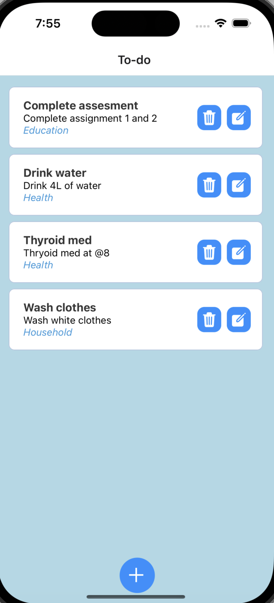
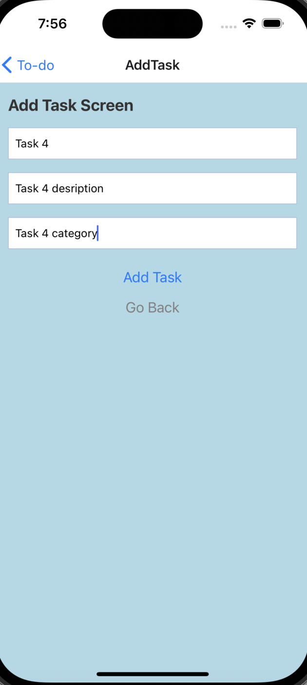
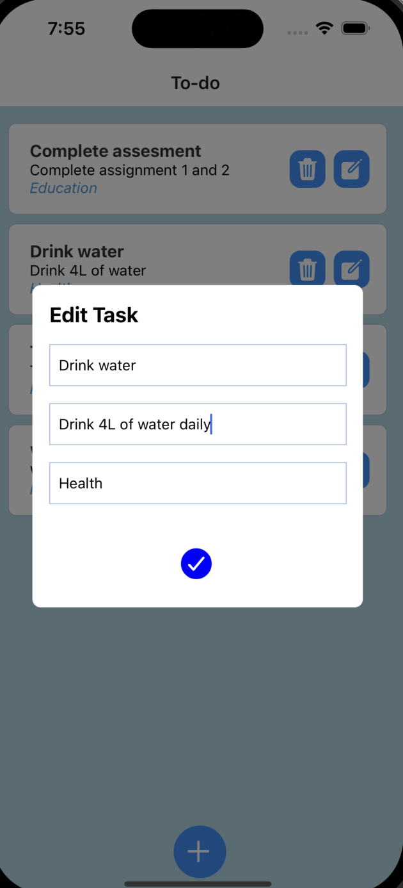
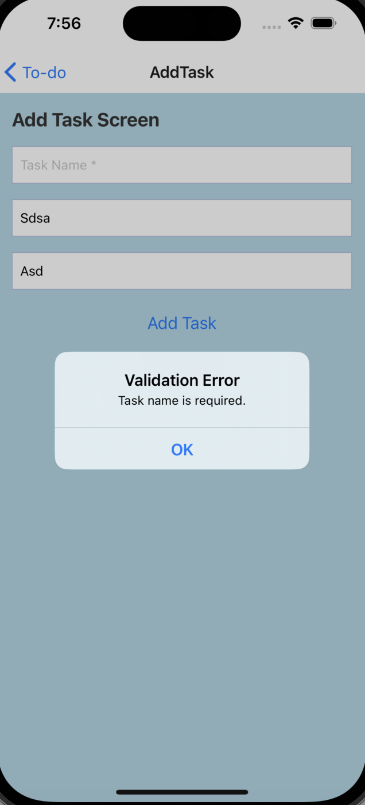

# React Native ToDo App 📝

A simple and efficient ToDo app built with React Native that helps you manage your tasks effortlessly. This app offers a clean user interface with features like task listing, adding, editing, and deleting tasks. With input error validation and persistent storage, your tasks are in safe hands.

## Features ✨

- **List All User Tasks**: View all your tasks at a glance in the list view.
- **Add, Edit, and Delete Tasks**: Easily add, edit, or delete tasks based on your needs.
- **Input Error Validation**: Ensure data integrity with input error validation, providing a smooth user experience.
- **Consistent and User-Friendly Design**: Experience a visually appealing and user-friendly design across both the task list and task addition screens.
- **State Management**: Efficient state management to handle the list of items and any new items added in real-time.
- **Persistent Storage**: Store your task list persistently, ensuring that your tasks remain available even if the app is closed and reopened.

## Screenshots 📸

Visual representation of the app with screenshots:







## Getting Started 🚀

To run this project locally, follow these steps:

### Prerequisites 🛠️

- [Node.js](https://nodejs.org/) installed on your machine
- [Expo CLI](https://docs.expo.dev/get-started/installation/) installed globally

### Installation 📦

1. **Clone the repository:**

    ```bash
    git clone https://github.com/your-username/react-native-todo-app.git
    ```

2. **Change into the project directory:**

    ```bash
    cd react-native-todo-app
    ```

3. **Install dependencies:**

    ```bash
    npm install
    ```

### Running the App ▶️

Use Expo CLI to run the app:

```bash
npx expo start

- This will open the Expo Developer Tools in your default web browser. You can run the app on an Android or iOS emulator, or use the Expo Go app on your mobile device by scanning the QR code.

Happy Coding!!